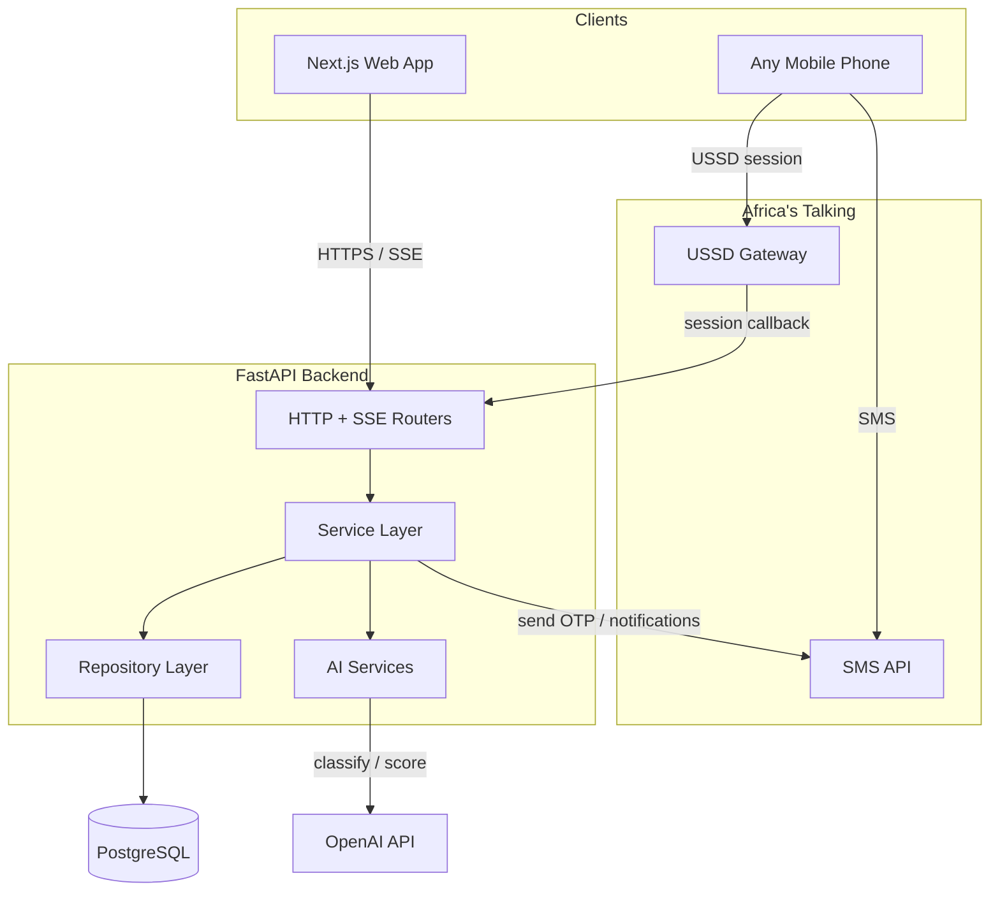
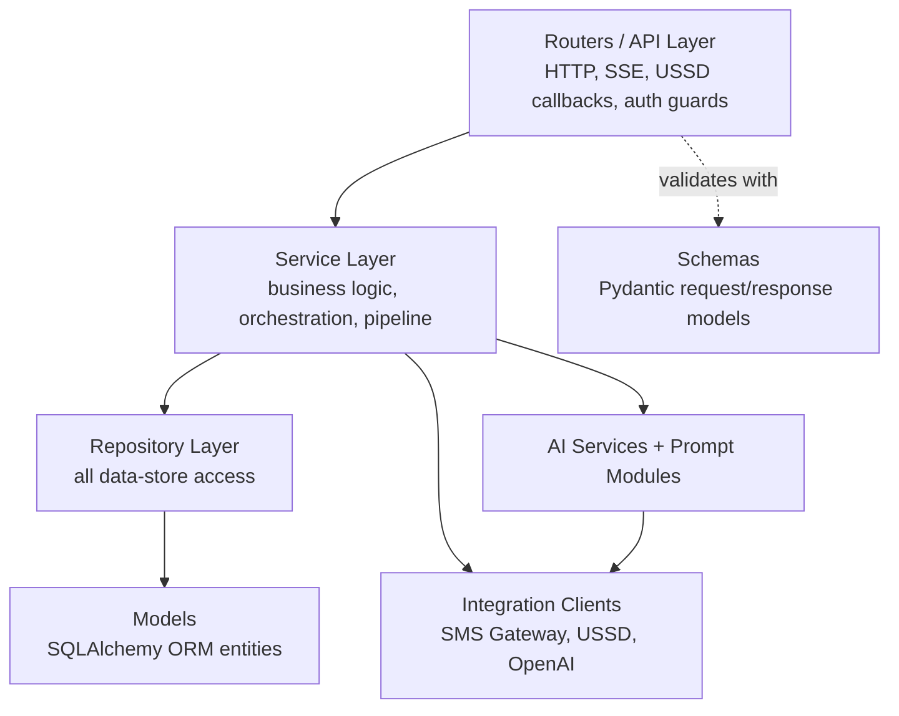
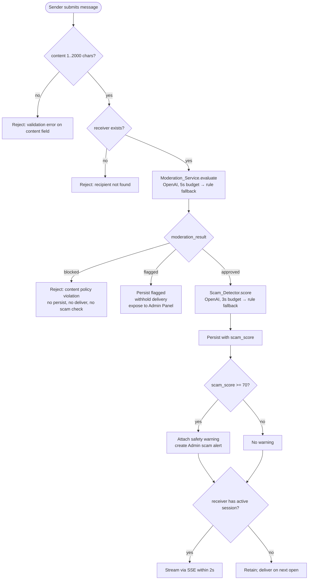
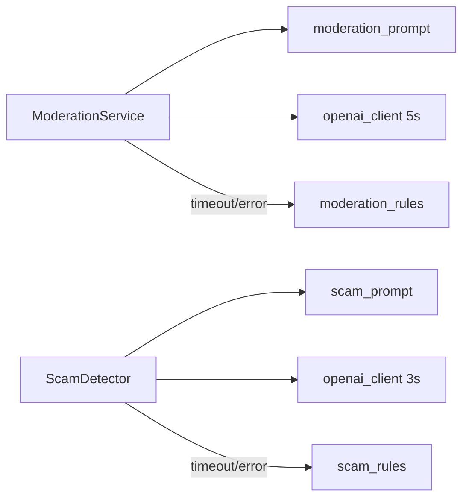
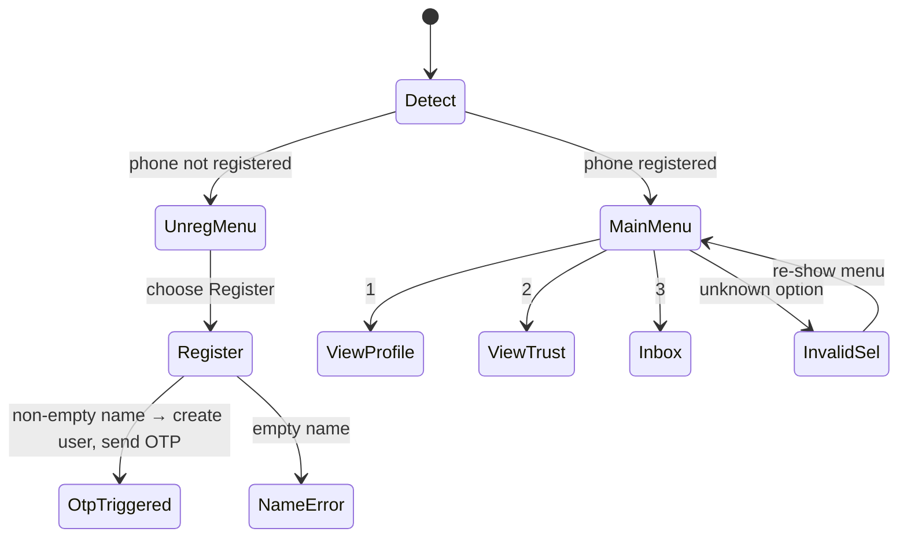
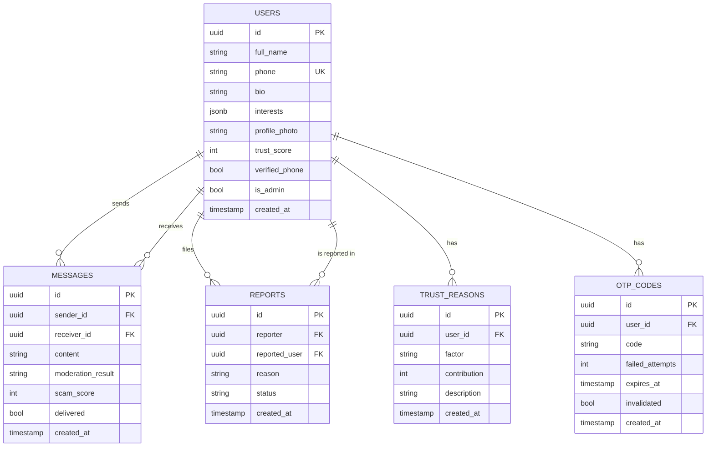

# Design Document: Ubuntu Connect

## Overview

Ubuntu Connect is an AI-powered trust platform for safe social networking across Africa. This document translates the 18 approved requirements into a concrete technical design covering the Next.js frontend, the FastAPI backend, the PostgreSQL data store, the OpenAI-backed AI services, and the Africa's Talking SMS and USSD integrations.

The design is anchored on four product pillars from the requirements:

1. **Identity verification** — phone registration plus OTP-over-SMS (Requirements 1, 2, 3).
2. **Trustworthiness scoring** — a deterministic Trust Engine driven by four factors (Requirement 5).
3. **Scam and content protection** — a moderation-then-scam pipeline on every message, backed by OpenAI with a rule-based fallback (Requirements 6, 7, 8, 9).
4. **Inclusive access** — SMS notifications and USSD sessions for users with limited internet (Requirements 13, 14).

The whole system is held together by a set of cross-cutting engineering requirements: clean architecture with the repository pattern, a component-and-hooks frontend, modular AI services, environment-variable configuration with fail-fast startup, OpenAPI docs on every endpoint, consistent error handling, a responsive and accessible layout, and a specific design system (Requirements 15, 16, 17, 18).

### Design Goals and Principles

- **Deterministic core, probabilistic edges.** Trust scoring, validation, and the message pipeline's control flow are deterministic and testable. Only the AI classification/scoring steps are probabilistic, and each has a deterministic rule-based fallback with a bounded timeout.
- **Protection never goes offline.** If OpenAI is slow or unavailable, moderation (5s budget) and scam scoring (3s budget) fall back to rules rather than failing open or blocking the platform.
- **One write path per message.** Every message travels the same pipeline: moderate → (scam score) → persist → deliver. There is no back door that skips checks.
- **Accessibility and inclusivity are structural, not cosmetic.** USSD/SMS parity for core reads, and WCAG-aligned contrast, focus, and touch targets are part of the component contracts.

### Technology Stack

| Layer | Choice | Rationale |
|-------|--------|-----------|
| Frontend | Next.js 15 (App Router), TypeScript, Tailwind CSS, shadcn/ui, React Hook Form | Server components for fast first paint, typed forms with schema validation, accessible primitives from shadcn/ui |
| Backend | FastAPI, Pydantic v2, SQLAlchemy 2.x | Native OpenAPI generation (Req 15.6), typed request/response schemas, mature async support for streaming |
| Data store | PostgreSQL 15 | Relational integrity for users/messages/reports, JSONB for interests and trust reason entries |
| Realtime | Server-Sent Events (SSE) over FastAPI | One-way server→client streaming fits message delivery (Req 6.2) with less overhead than WebSockets |
| AI | OpenAI API via modular prompt modules + rule-based fallback | Modular prompts (Req 15.3), bounded timeouts (Req 7.6, 8.2) |
| SMS/USSD | Africa's Talking SMS + USSD APIs | OTP, notifications, and inclusive access (Req 2, 13, 14) |
| Auth | JWT (24h expiry) | Stateless protected-endpoint auth (Req 3) |

## Architecture

### System Context



The web app talks to the backend over HTTPS for request/response and over SSE for live message delivery. Feature phones reach the same backend indirectly: Africa's Talking posts USSD session callbacks to a backend endpoint, and the backend calls the Africa's Talking SMS API for OTPs and notifications. The backend is the single authority; USSD and web are two front doors into the same services.

### Backend Layering (Clean Architecture + Repository Pattern)

The backend enforces Requirement 15.1: business logic never issues data-store queries directly. Layering is strict and one-directional (each layer depends only on the layer beneath it):



Directory structure:

```
backend/app/
├── main.py                  # app factory, startup config validation (Req 15.5)
├── config.py                # env-var loading + fail-fast validation
├── routers/                 # thin HTTP/SSE/USSD handlers, no business logic
│   ├── auth.py              # register, verify-otp, resend-otp, login
│   ├── profiles.py
│   ├── messages.py          # send + SSE stream + conversation history
│   ├── trust.py             # score + explanation
│   ├── reports.py
│   ├── admin.py             # flagged users, reports, scam alerts
│   └── ussd.py              # Africa's Talking USSD session callback
├── services/                # business logic (Req 15.1: no direct DB queries)
│   ├── auth_service.py
│   ├── otp_service.py
│   ├── profile_service.py
│   ├── messaging_service.py # the message pipeline orchestrator
│   ├── trust_engine.py
│   ├── report_service.py
│   ├── ussd_service.py
│   └── notification_service.py
├── repositories/            # all SQLAlchemy queries live here
│   ├── base.py
│   ├── user_repository.py
│   ├── message_repository.py
│   ├── report_repository.py
│   ├── otp_repository.py
│   └── trust_reason_repository.py
├── ai/
│   ├── moderation_service.py
│   ├── scam_detector.py
│   ├── fallback/            # deterministic rule-based classifiers
│   │   ├── moderation_rules.py
│   │   └── scam_rules.py
│   └── prompts/             # prompt modules, independent of calling logic (Req 15.3)
│       ├── moderation_prompt.py
│       └── scam_prompt.py
├── integrations/
│   ├── sms_gateway.py       # Africa's Talking SMS client
│   ├── ussd_gateway.py      # USSD menu/session helpers
│   └── openai_client.py     # timeout-bounded OpenAI wrapper
├── models/                  # SQLAlchemy ORM entities
└── schemas/                 # Pydantic request/response schemas
```

**Enforcement of the repository boundary:** services receive repository instances via FastAPI dependency injection. Services import repository interfaces, never `sqlalchemy` sessions or model query methods. A lint/architecture test asserts that no module under `services/` imports `sqlalchemy` (see Testing Strategy).

### Frontend Architecture (Component-Driven + Shared Hooks)

Requirement 15.2 requires views composed from named components and shared stateful logic encapsulated in hooks used by 2+ components. The App Router structure:

```
frontend/
├── app/
│   ├── (auth)/login/page.tsx
│   ├── (auth)/register/page.tsx        # includes OTP step
│   ├── (app)/dashboard/page.tsx
│   ├── (app)/profile/[id]/page.tsx
│   ├── (app)/chat/[userId]/page.tsx
│   ├── (app)/trust/page.tsx            # trust details + reasons
│   ├── (app)/notifications/page.tsx
│   ├── (app)/settings/page.tsx
│   └── (admin)/admin/page.tsx
├── components/
│   ├── ui/                             # shadcn/ui primitives
│   ├── trust/TrustScoreBadge.tsx
│   ├── trust/TrustReasonList.tsx
│   ├── chat/MessageBubble.tsx
│   ├── chat/ScamWarning.tsx
│   ├── chat/CautionIndicator.tsx
│   ├── chat/MessageComposer.tsx
│   ├── conversation/ConversationList.tsx
│   ├── feedback/LoadingState.tsx
│   ├── feedback/EmptyState.tsx
│   └── feedback/ErrorState.tsx         # with retry action
└── hooks/
    ├── useAuth.ts                      # used by dashboard, chat, profile, settings, admin
    ├── useAsyncResource.ts             # loading/empty/error/timeout state machine, used everywhere
    ├── useMessageStream.ts             # SSE subscription, used by chat + dashboard
    ├── useTrustScore.ts                # used by dashboard, profile, trust pages
    └── useToast.ts                     # used across forms and actions
```

Each hook listed is shared by two or more components/pages, satisfying Req 15.2. `useAsyncResource` centralizes the loading/empty/error/timeout contract from Requirement 16 so every data view behaves consistently.

### Request Lifecycle and Cross-Cutting Concerns

- **Auth guard:** a FastAPI dependency validates the JWT on every protected route, rejecting missing/expired/invalid tokens (Req 3.6). Admin routes add a role check (Req 11.1).
- **Validation:** Pydantic schemas validate every request body; failures produce a structured field-level error response (Req 16.1) before any service or repository runs.
- **Error envelope:** a global exception handler converts unhandled exceptions into a generic message with no internals leaked and no partial writes (Req 16.2), because all writes occur inside a transaction that rolls back on exception.
- **OpenAPI:** FastAPI auto-generates request and response schemas for every endpoint; every route declares an explicit `response_model` (Req 15.6).

## Components and Interfaces

### Auth and OTP

`AuthService` handles registration, login, and JWT issuance. `OTPService` owns generation, storage, expiry, attempt counting, and resend throttling.

Key endpoints:

| Method | Path | Request | Response | Requirements |
|--------|------|---------|----------|--------------|
| POST | `/api/auth/register` | `RegisterRequest{full_name, phone}` | `RegisterResponse{user_id, otp_sent}` | 1.1–1.6, 2.1 |
| POST | `/api/auth/verify-otp` | `VerifyOtpRequest{phone, code}` | `VerifyOtpResponse{verified}` | 2.3–2.6 |
| POST | `/api/auth/resend-otp` | `ResendOtpRequest{phone}` | `ResendOtpResponse{otp_sent}` | 2.7–2.9 |
| POST | `/api/auth/login` | `LoginRequest{phone, ...}` | `LoginResponse{jwt, expires_at}` | 3.1–3.5 |

OTP internals: a 6-digit numeric code, stored with `expires_at = now + 10min`, `failed_attempts`, and `attempt_window` records for the 5-per-60-minute resend cap. Verification checks match + expiry + attempt count in that order. On the 5th failed attempt the stored OTP is invalidated (Req 2.5).

### Profile Service

`ProfileService` validates and persists bio (≤500 chars), interests (≤20 items, each ≤50 chars), and photo (JPEG/PNG, ≤5 MB), and returns profiles with Trust_Score and Verified_Phone (Req 4). Rejected updates leave existing data unchanged (Req 4.4). Photos are stored in object storage; the DB holds the URL/key.

| Method | Path | Requirements |
|--------|------|--------------|
| PUT | `/api/profile/bio` | 4.1, 4.2 |
| PUT | `/api/profile/interests` | 4.3, 4.4 |
| POST | `/api/profile/photo` | 4.5–4.7 |
| GET | `/api/profile/{id}` | 4.8, 9.4 |

### Messaging Service and the Message-Send Pipeline

`MessagingService` orchestrates the single write path for every outgoing message. This is the heart of the platform's safety model.



Ordering guarantees from the requirements are explicit in the pipeline: a `blocked` result stops before scam detection and before persistence (Req 7.2); a `flagged` result persists but withholds delivery (Req 7.4); only `approved` proceeds to scam scoring (Req 7.3, 8.1). The scam threshold of 70 governs warnings and admin alerts (Req 8.3, 8.4, 8.5).

| Method | Path | Purpose | Requirements |
|--------|------|---------|--------------|
| POST | `/api/messages` | send through pipeline | 6.1, 6.5, 7.x, 8.x |
| GET | `/api/messages/{userId}` | conversation history asc | 6.3, 6.4, 6.6 |
| GET | `/api/messages/stream` | SSE live delivery | 6.2 |

### Trust Engine

`TrustEngine` computes a deterministic score in [0,100] from four factors and records a reason entry per factor. See the algorithm section below. Endpoints:

| Method | Path | Purpose | Requirements |
|--------|------|---------|--------------|
| GET | `/api/trust/{userId}` | current score | 5.1 |
| GET | `/api/trust/{userId}/explanation` | reason entries | 5.7, 5.8 |

Recalculation is triggered by phone verification (5.2), profile updates (5.3), confirmed reports (5.4), and message activity (5.5).

### AI Services and Prompt Modules

`ModerationService` and `ScamDetector` are separate modules (Req 15.3). Each depends on:
- an independent **prompt module** (`prompts/moderation_prompt.py`, `prompts/scam_prompt.py`) that builds the prompt but contains no calling logic;
- the timeout-bounded `openai_client`;
- a deterministic **rule-based fallback** invoked on timeout or error.



The fallbacks are pure functions over message text: `moderation_rules` maps banned/harmful keyword patterns to `blocked`/`flagged`/`approved`; `scam_rules` scores based on scam signal patterns (money requests, urgency, prize/airtime lures, links) clamped to [0,100]. Both AI paths and both fallback paths return the same typed result, so the pipeline is agnostic to which path produced it.

### Africa's Talking SMS and USSD Integration

`SmsGateway` wraps the Africa's Talking SMS API for three message types: OTP delivery (Req 2.1, 2.9), match notifications, and safety alerts (Req 14). Notifications are truncated to ≤160 chars and delivered within 30s, with up to 3 retries on failure and a recorded failure after all attempts fail (Req 14.1–14.4).

`UssdService` handles Africa's Talking session callbacks. It maintains a menu state machine keyed by the session's `text` parameter:



USSD responses honor the placeholders for empty bio/interests (Req 13.5), the 40-char inbox preview truncation and 5-message limit (Req 13.7), the empty-inbox message (Req 13.8), and re-showing the menu on invalid selection (Req 13.9).

### Admin Panel

`AdminService` (behind an Administrator role guard, Req 11.1) exposes flagged users (Req 11.2), reports with resolution (Req 11.3–11.6), and scam alerts ≥70 (Req 11.7). Report resolution only accepts `confirmed`/`dismissed` and only for `pending` reports.

### Reporting

`ReportService` creates reports (reason 1–1000 chars, status `pending`), blocking self-reports (Req 12.3), unknown reported users (Req 12.4), and duplicate pending reports (Req 12.6).

## Data Models

### Entity Relationship



### Core Tables

**users** (aligns with requirements' data model)
- `id` UUID PK
- `full_name` VARCHAR(100), 2–100 chars enforced at schema layer (Req 1.1, 1.5)
- `phone` VARCHAR, unique, E.164 (Req 1.2, 1.3)
- `bio` VARCHAR(500), nullable (Req 4.1, 4.2)
- `interests` JSONB, array of strings ≤20 items each ≤50 chars (Req 4.3)
- `profile_photo` VARCHAR (object-storage URL/key), nullable (Req 4.5)
- `trust_score` INT, default 0, [0,100] (Req 1.1, 5.1)
- `verified_phone` BOOLEAN, default false (Req 1.1, 2.3)
- `is_admin` BOOLEAN, default false (Req 11.1)
- `created_at` TIMESTAMP (Req 1.6)

**messages**
- `id` UUID PK, `sender_id`/`receiver_id` FK → users
- `content` VARCHAR(2000) (Req 6.1, 6.5)
- `moderation_result` VARCHAR — `approved` | `flagged` | `blocked` (Req 7.1)
- `scam_score` INT [0,100], nullable until scored (Req 8.1, 8.6)
- `delivered` BOOLEAN default false (Req 6.2, 6.6)
- `created_at` TIMESTAMP (Req 6.1)

**reports**
- `id` UUID PK, `reporter`/`reported_user` FK → users
- `reason` VARCHAR(1000) (Req 12.1, 12.5)
- `status` VARCHAR — `pending` | `confirmed` | `dismissed` (Req 12.1, 11.4)
- `created_at` TIMESTAMP (Req 12.1)

**trust_reasons** (backs Req 5.6, 5.7): one row per contributing factor per recalculation, storing the factor name, its numeric contribution, and a human-readable description.

**otp_codes** (backs Req 2): stores code, expiry, failed-attempt count, invalidation flag; resend throttling reads request timestamps in the trailing 60-minute window.

### Trust Engine Algorithm

The Trust Engine computes a score in [0,100] from four factors (Req 5.5). A concrete, deterministic weighting (each factor contributes a bounded, documented amount; the sum is clamped to [0,100]):

| Factor | Rule | Max contribution |
|--------|------|------------------|
| Phone verification (Req 5.2) | `verified_phone` → +30, else 0 | +30 |
| Profile completeness (Req 5.3) | +10 per populated field of {photo, bio, interests}, 0–3 populated | +30 |
| Confirmed reports (Req 5.4) | −15 per confirmed report | 0 (penalty) |
| Activity (Req 5.5) | +1 per message sent, capped | +40 |

```
raw = 30*verified + 10*populated_fields + min(messages_sent, 40) - 15*confirmed_reports
trust_score = clamp(raw, 0, 100)
```

Monotonicity properties the design guarantees:
- Verifying phone never lowers the score (Req 5.2): its contribution is non-negative.
- Each newly confirmed report yields a score no higher than before it (Req 5.4), because the penalty term only grows.

On every recalculation, the engine writes one `trust_reasons` row per factor (Req 5.6), e.g. for Zainab Abdullahi (+254712345678, unverified): "Phone verification: not verified (+0)", "Profile completeness: 1 of 3 fields (+10)", "Activity: 15 messages (+15)", "Confirmed reports: 0 (−0)" → clamp → 25. The explanation endpoint returns these entries (Req 5.7); a score with no entries returns an error (Req 5.8).

## Correctness Properties


*A property is a characteristic or behavior that should hold true across all valid executions of a system — essentially, a formal statement about what the system should do. Properties serve as the bridge between human-readable specifications and machine-verifiable correctness guarantees.*

Ubuntu Connect has substantial pure business logic (Trust Engine scoring, validation rules, OTP lifecycle, the moderation/scam pipeline control flow, scam/caution thresholds, USSD and SMS truncation, and retry bounds), so property-based testing applies. The AI classification/scoring calls are mocked so tests exercise our orchestration and fallback logic, not OpenAI's behavior. Properties below are derived from the prework classification; redundant criteria have been consolidated per the reflection notes.

### Property 1: Registration establishes defaults

*For any* valid full name (2–100 characters) and any E.164 phone not already registered, registering creates exactly one user record with `verified_phone` false, `trust_score` 0, and `created_at` set.

**Validates: Requirements 1.1, 1.6**

### Property 2: Duplicate phone registration is rejected without side effects

*For any* phone already belonging to a user, a subsequent registration with that phone is rejected and the total user count is unchanged.

**Validates: Requirements 1.2**

### Property 3: Registration input validation

*For any* registration request, it is rejected identifying the offending field(s) when the phone is not valid E.164, when the phone or full name is missing, when the full name is empty/whitespace, or when the full name length is <2 or >100; otherwise it is accepted.

**Validates: Requirements 1.3, 1.4, 1.5**

### Property 4: OTP generation shape and expiry

*For any* newly created user, the generated OTP is a 6-digit numeric code, an SMS send is requested to that user's phone, and the stored OTP expiry equals its creation time plus 10 minutes.

**Validates: Requirements 2.1, 2.2**

### Property 5: Correct OTP before expiry verifies the phone

*For any* stored OTP, submitting the matching code before its expiry sets the user's `verified_phone` to true.

**Validates: Requirements 2.3**

### Property 6: Wrong OTP attempts accumulate and cap at five

*For any* stored OTP, each wrong submission while fewer than 5 failures are recorded is rejected as incorrect and increments the failure count; the 5th wrong submission invalidates the OTP and returns a maximum-attempts error.

**Validates: Requirements 2.4, 2.5**

### Property 7: Expired OTP is rejected

*For any* stored OTP submitted at or after its expiry time, the submission is rejected as expired.

**Validates: Requirements 2.6**

### Property 8: OTP resend throttling

*For any* user with fewer than 5 OTP requests in the trailing 60 minutes, a resend invalidates the prior OTP, resets the failed-attempt count, and generates a new OTP; the 6th request within the window is rejected with the resend-limit error.

**Validates: Requirements 2.7, 2.8**

### Property 9: SMS delivery failure is recoverable

*For any* OTP send that the SMS gateway reports as failed, the service returns a send-failure error and a subsequent resend is still permitted.

**Validates: Requirements 2.9**

### Property 10: Login gating by verification and credentials

*For any* account, login issues a JWT identifying that user only when credentials are valid and `verified_phone` is true; it is rejected with a verification-required error when unverified, and with an authentication error when credentials match no record.

**Validates: Requirements 3.1, 3.2, 3.3**

### Property 11: Login credential validation

*For any* login request omitting a required credential field, the request is rejected identifying each missing field.

**Validates: Requirements 3.4**

### Property 12: JWT expiry is 24 hours

*For any* issued JWT, its expiry timestamp equals its issue timestamp plus 24 hours.

**Validates: Requirements 3.5**

### Property 13: Protected endpoints reject bad tokens

*For any* protected endpoint request carrying no token, an expired token, or an invalid/tampered token, the request is rejected with an authentication error.

**Validates: Requirements 3.6**

### Property 14: Bio round-trip and validation

*For any* bio of 500 characters or fewer, saving then reading it returns the same value; *for any* bio longer than 500 characters, the update is rejected identifying the bio field.

**Validates: Requirements 4.1, 4.2**

### Property 15: Interests round-trip and validation preserves prior value

*For any* interests list of at most 20 items each at most 50 characters, saving then reading returns the same list; *for any* list exceeding those limits, the update is rejected identifying the interests field and the previously stored interests are unchanged.

**Validates: Requirements 4.3, 4.4**

### Property 16: Photo format and size validation

*For any* uploaded photo, it is stored and associated with the user when it is JPEG or PNG and at most 5 MB; it is rejected identifying accepted formats for other formats, and rejected identifying the size limit when larger than 5 MB.

**Validates: Requirements 4.5, 4.6, 4.7**

### Property 17: Profile display includes trust and verification

*For any* user, the displayed profile payload includes that user's current Trust_Score and Verified_Phone state.

**Validates: Requirements 4.8, 9.4**

### Property 18: Trust score is a bounded integer

*For any* user state, the computed Trust_Score is an integer in the inclusive range [0, 100].

**Validates: Requirements 5.1**

### Property 19: Trust score factor monotonicity

*For any* two user states differing only in one factor, the Trust_Score is non-decreasing as phone verification becomes true, non-decreasing as more of the three profile fields are populated, and non-increasing as the count of confirmed reports increases.

**Validates: Requirements 5.2, 5.3, 5.4**

### Property 20: Trust score equals its four-factor function

*For any* user state, the Trust_Score equals the documented clamped function of exactly the four factors (phone verification, populated profile-field count, confirmed-report count, messages sent); changing an input outside those four does not change the score.

**Validates: Requirements 5.5**

### Property 21: Trust reasons are complete and round-trip through explanation

*For any* Trust_Score recalculation, the engine records one reason entry per contributing factor, and requesting the explanation returns exactly the recorded reason entries.

**Validates: Requirements 5.6, 5.7**

### Property 22: Passing message persists all fields and round-trips

*For any* message of 1–2000 characters that passes moderation and scam checks, it is persisted with sender_id, receiver_id, content, moderation_result, scam_score, and created_at, and reading it back yields the same values.

**Validates: Requirements 6.1**

### Property 23: Conversation history is complete and ordered ascending

*For any* set of messages exchanged between two users, opening the conversation returns exactly those messages ordered by created_at ascending.

**Validates: Requirements 6.3**

### Property 24: Message content-length validation

*For any* submitted message whose content is empty or longer than 2000 characters, the message is rejected with a validation error identifying the content field.

**Validates: Requirements 6.5**

### Property 25: Offline messages are retained and later delivered

*For any* message accepted for a receiver with no active session, the message is retained and appears when the receiver next opens the conversation.

**Validates: Requirements 6.6**

### Property 26: Moderation always yields a valid label, including on fallback

*For any* message — including when the OpenAI API is unavailable — moderation assigns a Moderation_Result that is one of "approved", "flagged", or "blocked".

**Validates: Requirements 7.1, 7.5**

### Property 27: Blocked messages halt the pipeline with no side effects

*For any* message whose Moderation_Result is "blocked", the message is neither persisted nor delivered, scam detection is not invoked, and a content-policy error is returned.

**Validates: Requirements 7.2**

### Property 28: Approved messages proceed to scam detection

*For any* message whose Moderation_Result is "approved", the scam detector is invoked.

**Validates: Requirements 7.3**

### Property 29: Flagged messages persist but are withheld and exposed to admins

*For any* message whose Moderation_Result is "flagged", the message is persisted with the flagged result, withheld from delivery to the receiver, and made available to the Admin_Panel.

**Validates: Requirements 7.4**

### Property 30: Scam score is a bounded integer, including on fallback

*For any* message that passes moderation — including when OpenAI errors or exceeds its time budget — the assigned Scam_Score is an integer in [0, 100] and is stored on the message before delivery.

**Validates: Requirements 8.1, 8.2, 8.6**

### Property 31: Scam warning threshold at 70

*For any* delivered message, a scam safety warning is attached if and only if its Scam_Score is 70 or greater.

**Validates: Requirements 8.3, 8.5**

### Property 32: High scam scores create admin alerts

*For any* message with a Scam_Score of 70 or greater, a scam alert available to the Admin_Panel is created.

**Validates: Requirements 8.4**

### Property 33: Scam warning rendering follows the message flag

*For any* rendered message, the scam warning is displayed adjacent to the content if and only if the message carries the scam safety warning.

**Validates: Requirements 9.1**

### Property 34: Caution indicator threshold at 30

*For any* rendered conversation, a caution indicator is displayed if and only if the partner's Trust_Score is below 30.

**Validates: Requirements 9.2, 9.3**

### Property 35: Dashboard conversation limit and ordering

*For any* set of a user's conversations, the Dashboard displays at most the 20 most recent, ordered by each conversation's most recent message created_at descending.

**Validates: Requirements 10.1**

### Property 36: Dashboard shows only unread safety notifications

*For any* mix of read and unread safety notifications for a user, the Dashboard displays exactly the unread ones.

**Validates: Requirements 10.3**

### Property 37: Admin routes reject non-administrators

*For any* request to an Admin_Panel route from a non-Administrator account, the request is rejected with an authorization error.

**Validates: Requirements 11.1**

### Property 38: Flagged-users view membership and ordering

*For any* dataset, the flagged-users view lists exactly the users having at least one flagged message or at least one confirmed report, ordered by their most recent flagged message or confirmed report descending.

**Validates: Requirements 11.2**

### Property 39: Reports view fields and ordering

*For any* set of reports, the reports view shows each report's reporter, reported_user, reason, and status, ordered by created_at descending.

**Validates: Requirements 11.3**

### Property 40: Report resolution validity

*For any* pending report, resolving it with "confirmed" or "dismissed" updates its status to that decision; *for any* other decision value, the request is rejected identifying the accepted values and the status is unchanged.

**Validates: Requirements 11.4, 11.5**

### Property 41: Scam alerts view membership and ordering

*For any* set of messages, the scam alerts view shows exactly the messages with a Scam_Score of 70 or greater, ordered by created_at descending.

**Validates: Requirements 11.7**

### Property 42: Report creation defaults and validation

*For any* report submission, when it identifies an existing other user and a reason of 1–1000 characters it creates a record with reporter, reported_user, reason, status "pending", and created_at; it is rejected identifying missing fields when reported_user or reason is absent, for self-reporting, and when the reason exceeds 1000 characters.

**Validates: Requirements 12.1, 12.2, 12.3, 12.5**

### Property 43: Duplicate pending report is rejected

*For any* reporter with an existing pending report against a given user, a second report against that same user is rejected indicating a pending report already exists.

**Validates: Requirements 12.6**

### Property 44: USSD menu depends on registration state

*For any* USSD session, an unregistered phone is offered a register option, and a registered user is offered view-profile, view-trust-score, and inbox-preview options.

**Validates: Requirements 13.1, 13.2**

### Property 45: USSD registration creates a user with defaults and triggers OTP

*For any* non-empty full name provided over USSD for an unregistered phone, a user record is created with `verified_phone` false and `trust_score` 0 and OTP delivery is triggered through the SMS_Gateway.

**Validates: Requirements 13.3**

### Property 46: USSD profile view uses placeholders for empty fields

*For any* registered user, the USSD view-profile response includes the full name and returns a placeholder wherever the bio or interests are empty.

**Validates: Requirements 13.5**

### Property 47: USSD trust score view returns current score

*For any* registered user, the USSD view-trust-score response includes that user's current Trust_Score.

**Validates: Requirements 13.6**

### Property 48: USSD inbox preview limit and truncation

*For any* registered user's messages, the USSD inbox preview returns at most the 5 most recent, each showing the sender name and a content preview truncated to 40 characters.

**Validates: Requirements 13.7**

### Property 49: USSD invalid selection re-shows the menu

*For any* menu selection not offered in the current USSD menu, the service returns the current menu again with a message indicating the selection is not valid.

**Validates: Requirements 13.9**

### Property 50: SMS notifications are truncated to 160 characters

*For any* match notification or safety alert, the text sent through the SMS_Gateway is truncated to 160 characters or fewer.

**Validates: Requirements 14.1, 14.2**

### Property 51: Notification retry bound and failure recording

*For any* notification whose delivery keeps failing, delivery is attempted at most 4 times total (initial plus 3 retries), and if all attempts fail a failure record is written capturing the target phone number and the notification type.

**Validates: Requirements 14.3, 14.4**

### Property 52: Missing required env vars halt startup and are all named

*For any* subset of required environment variables that is absent at startup, the backend halts without serving requests and emits an error naming each missing variable.

**Validates: Requirements 15.5**

### Property 53: Validation rejects with per-field reasons and no writes

*For any* request with input that fails validation, the request is rejected, no changes are written to the data store, and the error response identifies each invalid field together with the reason it failed.

**Validates: Requirements 16.1**

### Property 54: Unhandled exceptions produce safe responses and no partial writes

*For any* backend operation that raises an unhandled exception, the response carries a generic message with no internal details and previously persisted data is left unchanged.

**Validates: Requirements 16.2**

### Property 55: Spacing tokens are multiples of 8 pixels

*For any* layout margin, padding, or gap value used by the frontend, the value is a whole multiple of 8 pixels.

**Validates: Requirements 17.3**

### Property 56: Text contrast meets 4.5:1

*For any* text/background color-token pair used for normal-size text, the contrast ratio is at least 4.5:1.

**Validates: Requirements 17.5**

### Property 57: Touch targets meet 44x44 on small viewports

*For any* interactive element rendered at a viewport width of 640 pixels or less, its touch target is at least 44 by 44 pixels.

**Validates: Requirements 17.6**

### Property 58: Transitions are at most 200 milliseconds

*For any* interface transition token, its duration is 200 milliseconds or less.

**Validates: Requirements 18.3**

### Property 59: Trust badge value and accent threshold

*For any* displayed profile, the Trust_Score badge shows the user's score as an integer in [0, 100], and is rendered with the accent color #F59E0B if and only if the score is 70 or greater.

**Validates: Requirements 18.4, 18.5, 18.6**
