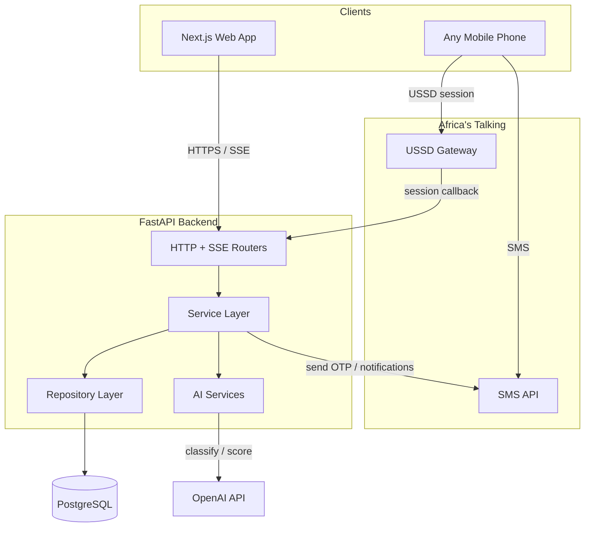
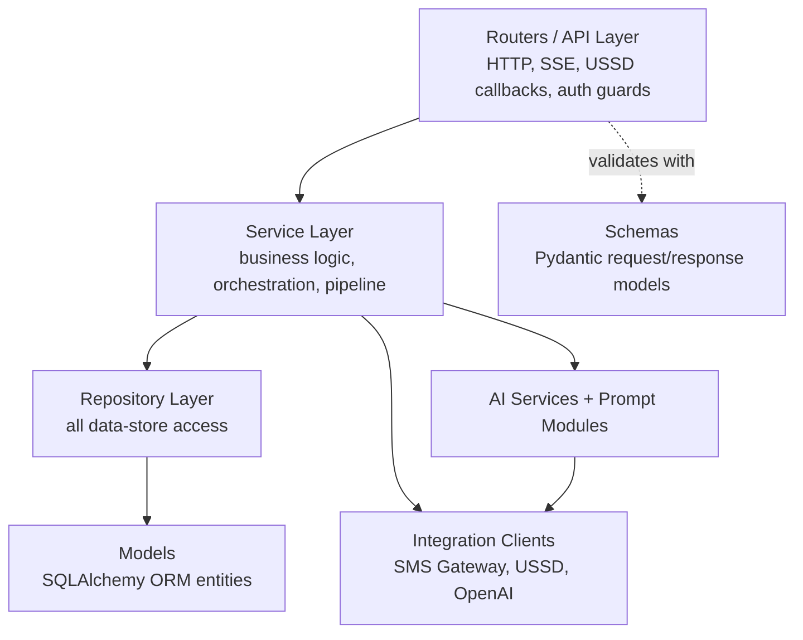
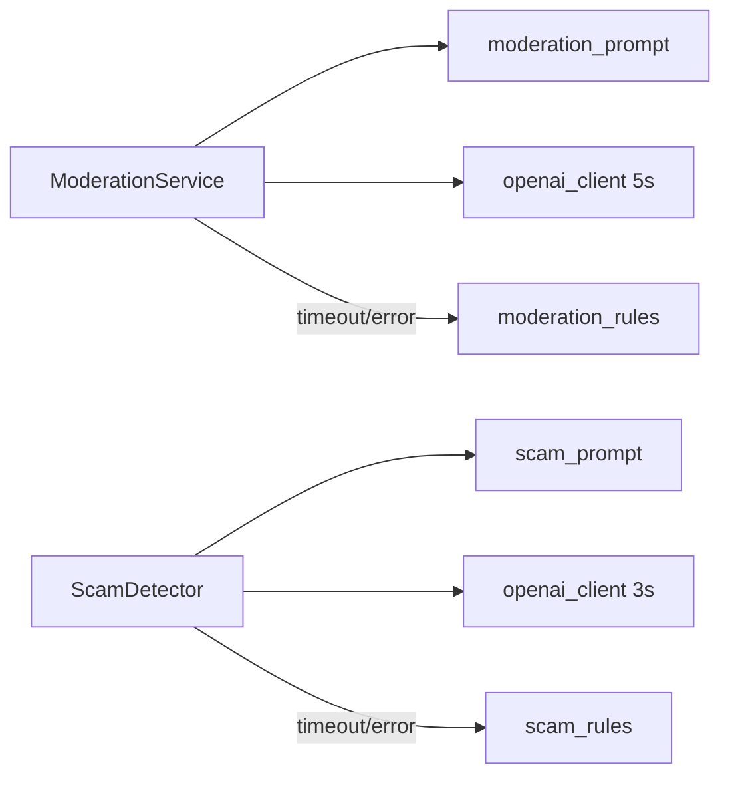
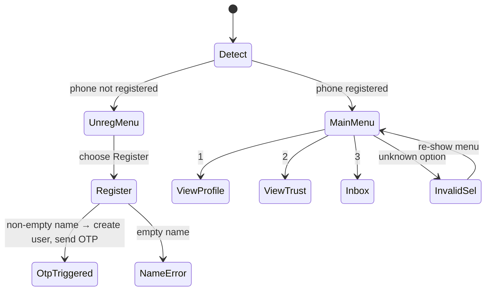
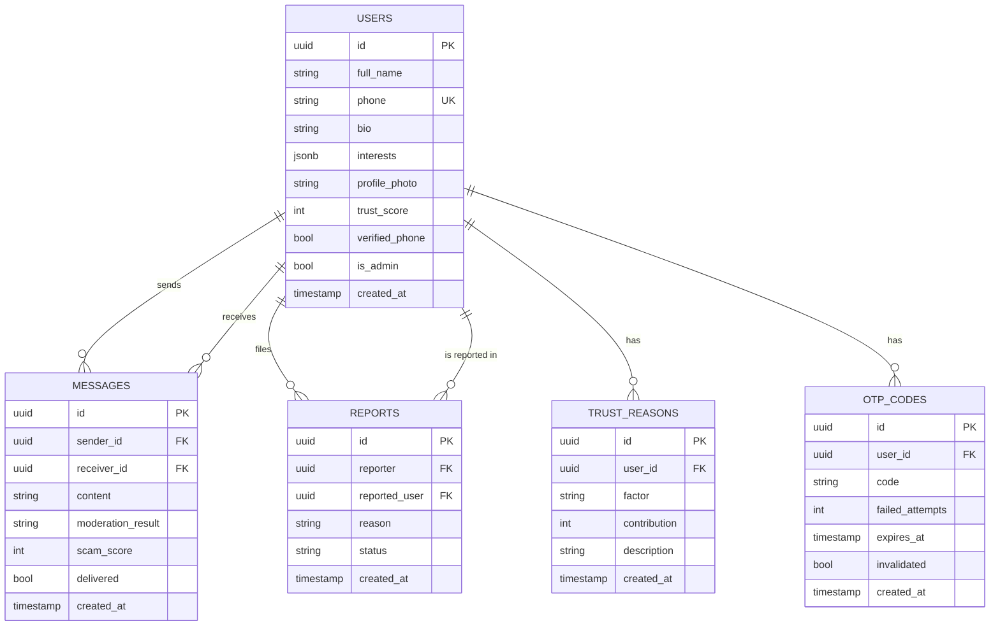

# Design Document: Ubuntu Connect

## Overview

Ubuntu Connect is an AI-powered trust platform for safe social networking across Africa. This document translates the 18 approved requirements into a concrete technical design covering the Next.js frontend, the FastAPI backend, the PostgreSQL data store, the OpenAI-backed AI services, and the Africa's Talking SMS and USSD integrations.

The design is anchored on four product pillars from the requirements:

1. **Identity verification** — phone registration plus OTP-over-SMS (Requirements 1, 2, 3).
2. **Trustworthiness scoring** — a deterministic Trust Engine driven by four factors (Requirement 5).
3. **Scam and content protection** — a moderation-then-scam pipeline on every message, backed by OpenAI with a rule-based fallback (Requirements 6, 7, 8, 9).
4. **Inclusive access** — SMS notifications and USSD sessions for users with limited internet (Requirements 13, 14).

The whole system is held together by a set of cross-cutting engineering requirements: clean architecture with the repository pattern, a component-and-hooks frontend, modular AI services, environment-variable configuration with fail-fast startup, OpenAPI docs on every endpoint, consistent error handling, a responsive and accessible layout, and a specific design system (Requirements 15, 16, 17, 18).

### Design Goals and Principles

- **Deterministic core, probabilistic edges.** Trust scoring, validation, and the message pipeline's control flow are deterministic and testable. Only the AI classification/scoring steps are probabilistic, and each has a deterministic rule-based fallback with a bounded timeout.
- **Protection never goes offline.** If OpenAI is slow or unavailable, moderation (5s budget) and scam scoring (3s budget) fall back to rules rather than failing open or blocking the platform.
- **One write path per message.** Every message travels the same pipeline: moderate → (scam score) → persist → deliver. There is no back door that skips checks.
- **Accessibility and inclusivity are structural, not cosmetic.** USSD/SMS parity for core reads, and WCAG-aligned contrast, focus, and touch targets are part of the component contracts.

### Technology Stack

| Layer | Choice | Rationale |
|-------|--------|-----------|
| Frontend | Next.js 15 (App Router), TypeScript, Tailwind CSS, shadcn/ui, React Hook Form | Server components for fast first paint, typed forms with schema validation, accessible primitives from shadcn/ui |
| Backend | FastAPI, Pydantic v2, SQLAlchemy 2.x | Native OpenAPI generation (Req 15.6), typed request/response schemas, mature async support for streaming |
| Data store | PostgreSQL 15 | Relational integrity for users/messages/reports, JSONB for interests and trust reason entries |
| Realtime | Server-Sent Events (SSE) over FastAPI | One-way server→client streaming fits message delivery (Req 6.2) with less overhead than WebSockets |
| AI | OpenAI API via modular prompt modules + rule-based fallback | Modular prompts (Req 15.3), bounded timeouts (Req 7.6, 8.2) |
| SMS/USSD | Africa's Talking SMS + USSD APIs | OTP, notifications, and inclusive access (Req 2, 13, 14) |
| Auth | JWT (24h expiry) | Stateless protected-endpoint auth (Req 3) |

## Architecture

### System Context



The web app talks to the backend over HTTPS for request/response and over SSE for live message delivery. Feature phones reach the same backend indirectly: Africa's Talking posts USSD session callbacks to a backend endpoint, and the backend calls the Africa's Talking SMS API for OTPs and notifications. The backend is the single authority; USSD and web are two front doors into the same services.

### Backend Layering (Clean Architecture + Repository Pattern)

The backend enforces Requirement 15.1: business logic never issues data-store queries directly. Layering is strict and one-directional (each layer depends only on the layer beneath it):



Directory structure:

```
backend/app/
├── main.py                  # app factory, startup config validation (Req 15.5)
├── config.py                # env-var loading + fail-fast validation
├── routers/                 # thin HTTP/SSE/USSD handlers, no business logic
│   ├── auth.py              # register, verify-otp, resend-otp, login
│   ├── profiles.py
│   ├── messages.py          # send + SSE stream + conversation history
│   ├── trust.py             # score + explanation
│   ├── reports.py
│   ├── admin.py             # flagged users, reports, scam alerts
│   └── ussd.py              # Africa's Talking USSD session callback
├── services/                # business logic (Req 15.1: no direct DB queries)
│   ├── auth_service.py
│   ├── otp_service.py
│   ├── profile_service.py
│   ├── messaging_service.py # the message pipeline orchestrator
│   ├── trust_engine.py
│   ├── report_service.py
│   ├── ussd_service.py
│   └── notification_service.py
├── repositories/            # all SQLAlchemy queries live here
│   ├── base.py
│   ├── user_repository.py
│   ├── message_repository.py
│   ├── report_repository.py
│   ├── otp_repository.py
│   └── trust_reason_repository.py
├── ai/
│   ├── moderation_service.py
│   ├── scam_detector.py
│   ├── fallback/            # deterministic rule-based classifiers
│   │   ├── moderation_rules.py
│   │   └── scam_rules.py
│   └── prompts/             # prompt modules, independent of calling logic (Req 15.3)
│       ├── moderation_prompt.py
│       └── scam_prompt.py
├── integrations/
│   ├── sms_gateway.py       # Africa's Talking SMS client
│   ├── ussd_gateway.py      # USSD menu/session helpers
│   └── openai_client.py     # timeout-bounded OpenAI wrapper
├── models/                  # SQLAlchemy ORM entities
└── schemas/                 # Pydantic request/response schemas
```

**Enforcement of the repository boundary:** services receive repository instances via FastAPI dependency injection. Services import repository interfaces, never `sqlalchemy` sessions or model query methods. A lint/architecture test asserts that no module under `services/` imports `sqlalchemy` (see Testing Strategy).

### Frontend Architecture (Component-Driven + Shared Hooks)

Requirement 15.2 requires views composed from named components and shared stateful logic encapsulated in hooks used by 2+ components. The App Router structure:

```
frontend/
├── app/
│   ├── (auth)/login/page.tsx
│   ├── (auth)/register/page.tsx        # includes OTP step
│   ├── (app)/dashboard/page.tsx
│   ├── (app)/profile/[id]/page.tsx
│   ├── (app)/chat/[userId]/page.tsx
│   ├── (app)/trust/page.tsx            # trust details + reasons
│   ├── (app)/notifications/page.tsx
│   ├── (app)/settings/page.tsx
│   └── (admin)/admin/page.tsx
├── components/
│   ├── ui/                             # shadcn/ui primitives
│   ├── trust/TrustScoreBadge.tsx
│   ├── trust/TrustReasonList.tsx
│   ├── chat/MessageBubble.tsx
│   ├── chat/ScamWarning.tsx
│   ├── chat/CautionIndicator.tsx
│   ├── chat/MessageComposer.tsx
│   ├── conversation/ConversationList.tsx
│   ├── feedback/LoadingState.tsx
│   ├── feedback/EmptyState.tsx
│   └── feedback/ErrorState.tsx         # with retry action
└── hooks/
    ├── useAuth.ts                      # used by dashboard, chat, profile, settings, admin
    ├── useAsyncResource.ts             # loading/empty/error/timeout state machine, used everywhere
    ├── useMessageStream.ts             # SSE subscription, used by chat + dashboard
    ├── useTrustScore.ts                # used by dashboard, profile, trust pages
    └── useToast.ts                     # used across forms and actions
```

Each hook listed is shared by two or more components/pages, satisfying Req 15.2. `useAsyncResource` centralizes the loading/empty/error/timeout contract from Requirement 16 so every data view behaves consistently.

### Request Lifecycle and Cross-Cutting Concerns

- **Auth guard:** a FastAPI dependency validates the JWT on every protected route, rejecting missing/expired/invalid tokens (Req 3.6). Admin routes add a role check (Req 11.1).
- **Validation:** Pydantic schemas validate every request body; failures produce a structured field-level error response (Req 16.1) before any service or repository runs.
- **Error envelope:** a global exception handler converts unhandled exceptions into a generic message with no internals leaked and no partial writes (Req 16.2), because all writes occur inside a transaction that rolls back on exception.
- **OpenAPI:** FastAPI auto-generates request and response schemas for every endpoint; every route declares an explicit `response_model` (Req 15.6).

## Components and Interfaces

### Auth and OTP

`AuthService` handles registration, login, and JWT issuance. `OTPService` owns generation, storage, expiry, attempt counting, and resend throttling.

Key endpoints:

| Method | Path | Request | Response | Requirements |
|--------|------|---------|----------|--------------|
| POST | `/api/auth/register` | `RegisterRequest{full_name, phone}` | `RegisterResponse{user_id, otp_sent}` | 1.1–1.6, 2.1 |
| POST | `/api/auth/verify-otp` | `VerifyOtpRequest{phone, code}` | `VerifyOtpResponse{verified}` | 2.3–2.6 |
| POST | `/api/auth/resend-otp` | `ResendOtpRequest{phone}` | `ResendOtpResponse{otp_sent}` | 2.7–2.9 |
| POST | `/api/auth/login` | `LoginRequest{phone, ...}` | `LoginResponse{jwt, expires_at}` | 3.1–3.5 |

OTP internals: a 6-digit numeric code, stored with `expires_at = now + 10min`, `failed_attempts`, and `attempt_window` records for the 5-per-60-minute resend cap. Verification checks match + expiry + attempt count in that order. On the 5th failed attempt the stored OTP is invalidated (Req 2.5).

### Profile Service

`ProfileService` validates and persists bio (≤500 chars), interests (≤20 items, each ≤50 chars), and photo (JPEG/PNG, ≤5 MB), and returns profiles with Trust_Score and Verified_Phone (Req 4). Rejected updates leave existing data unchanged (Req 4.4). Photos are stored in object storage; the DB holds the URL/key.

| Method | Path | Requirements |
|--------|------|--------------|
| PUT | `/api/profile/bio` | 4.1, 4.2 |
| PUT | `/api/profile/interests` | 4.3, 4.4 |
| POST | `/api/profile/photo` | 4.5–4.7 |
| GET | `/api/profile/{id}` | 4.8, 9.4 |

### Messaging Service and the Message-Send Pipeline

`MessagingService` orchestrates the single write path for every outgoing message. This is the heart of the platform's safety model.


Ordering guarantees from the requirements are explicit in the pipeline: a `blocked` result stops before scam detection and before persistence (Req 7.2); a `flagged` result persists but withholds delivery (Req 7.4); only `approved` proceeds to scam scoring (Req 7.3, 8.1). The scam threshold of 70 governs warnings and admin alerts (Req 8.3, 8.4, 8.5).

| Method | Path | Purpose | Requirements |
|--------|------|---------|--------------|
| POST | `/api/messages` | send through pipeline | 6.1, 6.5, 7.x, 8.x |
| GET | `/api/messages/{userId}` | conversation history asc | 6.3, 6.4, 6.6 |
| GET | `/api/messages/stream` | SSE live delivery | 6.2 |

### Trust Engine

`TrustEngine` computes a deterministic score in [0,100] from four factors and records a reason entry per factor. See the algorithm section below. Endpoints:

| Method | Path | Purpose | Requirements |
|--------|------|---------|--------------|
| GET | `/api/trust/{userId}` | current score | 5.1 |
| GET | `/api/trust/{userId}/explanation` | reason entries | 5.7, 5.8 |

Recalculation is triggered by phone verification (5.2), profile updates (5.3), confirmed reports (5.4), and message activity (5.5).

### AI Services and Prompt Modules

`ModerationService` and `ScamDetector` are separate modules (Req 15.3). Each depends on:
- an independent **prompt module** (`prompts/moderation_prompt.py`, `prompts/scam_prompt.py`) that builds the prompt but contains no calling logic;
- the timeout-bounded `openai_client`;
- a deterministic **rule-based fallback** invoked on timeout or error.



The fallbacks are pure functions over message text: `moderation_rules` maps banned/harmful keyword patterns to `blocked`/`flagged`/`approved`; `scam_rules` scores based on scam signal patterns (money requests, urgency, prize/airtime lures, links) clamped to [0,100]. Both AI paths and both fallback paths return the same typed result, so the pipeline is agnostic to which path produced it.

### Africa's Talking SMS and USSD Integration

`SmsGateway` wraps the Africa's Talking SMS API for three message types: OTP delivery (Req 2.1, 2.9), match notifications, and safety alerts (Req 14). Notifications are truncated to ≤160 chars and delivered within 30s, with up to 3 retries on failure and a recorded failure after all attempts fail (Req 14.1–14.4).

`UssdService` handles Africa's Talking session callbacks. It maintains a menu state machine keyed by the session's `text` parameter:



USSD responses honor the placeholders for empty bio/interests (Req 13.5), the 40-char inbox preview truncation and 5-message limit (Req 13.7), the empty-inbox message (Req 13.8), and re-showing the menu on invalid selection (Req 13.9).

### Admin Panel

`AdminService` (behind an Administrator role guard, Req 11.1) exposes flagged users (Req 11.2), reports with resolution (Req 11.3–11.6), and scam alerts ≥70 (Req 11.7). Report resolution only accepts `confirmed`/`dismissed` and only for `pending` reports.

### Reporting

`ReportService` creates reports (reason 1–1000 chars, status `pending`), blocking self-reports (Req 12.3), unknown reported users (Req 12.4), and duplicate pending reports (Req 12.6).

## Data Models

### Entity Relationship



### Core Tables

**users** (aligns with requirements' data model)
- `id` UUID PK
- `full_name` VARCHAR(100), 2–100 chars enforced at schema layer (Req 1.1, 1.5)
- `phone` VARCHAR, unique, E.164 (Req 1.2, 1.3)
- `bio` VARCHAR(500), nullable (Req 4.1, 4.2)
- `interests` JSONB, array of strings ≤20 items each ≤50 chars (Req 4.3)
- `profile_photo` VARCHAR (object-storage URL/key), nullable (Req 4.5)
- `trust_score` INT, default 0, [0,100] (Req 1.1, 5.1)
- `verified_phone` BOOLEAN, default false (Req 1.1, 2.3)
- `is_admin` BOOLEAN, default false (Req 11.1)
- `created_at` TIMESTAMP (Req 1.6)

**messages**
- `id` UUID PK, `sender_id`/`receiver_id` FK → users
- `content` VARCHAR(2000) (Req 6.1, 6.5)
- `moderation_result` VARCHAR — `approved` | `flagged` | `blocked` (Req 7.1)
- `scam_score` INT [0,100], nullable until scored (Req 8.1, 8.6)
- `delivered` BOOLEAN default false (Req 6.2, 6.6)
- `created_at` TIMESTAMP (Req 6.1)

**reports**
- `id` UUID PK, `reporter`/`reported_user` FK → users
- `reason` VARCHAR(1000) (Req 12.1, 12.5)
- `status` VARCHAR — `pending` | `confirmed` | `dismissed` (Req 12.1, 11.4)
- `created_at` TIMESTAMP (Req 12.1)

**trust_reasons** (backs Req 5.6, 5.7): one row per contributing factor per recalculation, storing the factor name, its numeric contribution, and a human-readable description.

**otp_codes** (backs Req 2): stores code, expiry, failed-attempt count, invalidation flag; resend throttling reads request timestamps in the trailing 60-minute window.

### Trust Engine Algorithm

The Trust Engine computes a score in [0,100] from four factors (Req 5.5). A concrete, deterministic weighting (each factor contributes a bounded, documented amount; the sum is clamped to [0,100]):

| Factor | Rule | Max contribution |
|--------|------|------------------|
| Phone verification (Req 5.2) | `verified_phone` → +30, else 0 | +30 |
| Profile completeness (Req 5.3) | +10 per populated field of {photo, bio, interests}, 0–3 populated | +30 |
| Confirmed reports (Req 5.4) | −15 per confirmed report | 0 (penalty) |
| Activity (Req 5.5) | +1 per message sent, capped | +40 |

```
raw = 30*verified + 10*populated_fields + min(messages_sent, 40) - 15*confirmed_reports
trust_score = clamp(raw, 0, 100)
```

Monotonicity properties the design guarantees:
- Verifying phone never lowers the score (Req 5.2): its contribution is non-negative.
- Each newly confirmed report yields a score no higher than before it (Req 5.4), because the penalty term only grows.

On every recalculation, the engine writes one `trust_reasons` row per factor (Req 5.6), e.g. for Zainab Abdullahi (+254712345678, unverified): "Phone verification: not verified (+0)", "Profile completeness: 1 of 3 fields (+10)", "Activity: 15 messages (+15)", "Confirmed reports: 0 (−0)" → clamp → 25. The explanation endpoint returns these entries (Req 5.7); a score with no entries returns an error (Req 5.8).

## Correctness Properties
